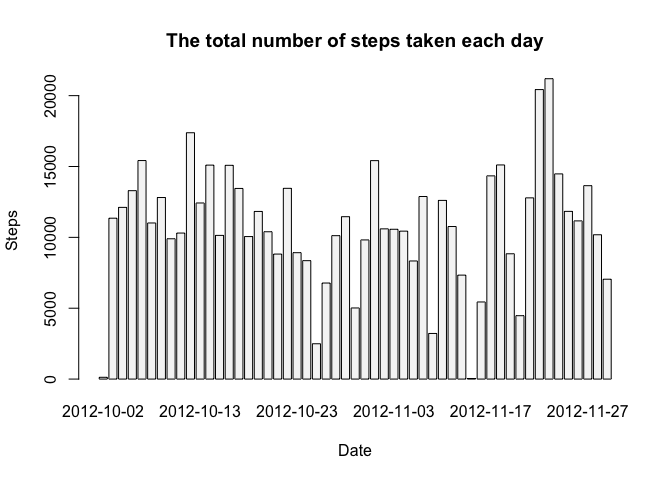
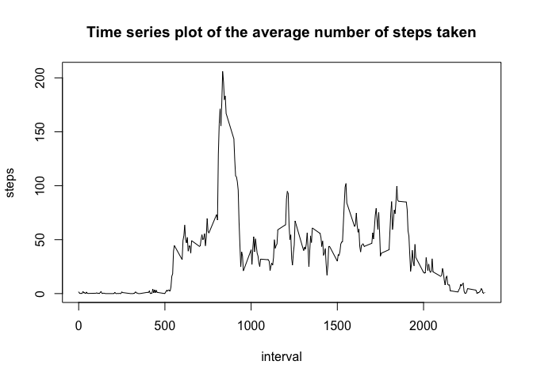
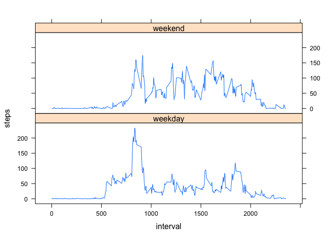

# Reproducible Research: Peer Assessment 1


## Loading and preprocessing the data
1. Code for reading in the dataset and/or processing the data

1.1. Load the data (i.e. `read.csv()`)


```r
# Cleanup the environment
rm(list=ls(all=TRUE))
# Read file in the same folder as the R script into a data.frame
data <- read.csv(unz("activity.zip", "activity.csv"))
```
The variables included in this dataset are:

* **steps**: Number of steps taking in a 5-minute interval (missing
    values are coded as `NA`)

* **date**: The date on which the measurement was taken in YYYY-MM-DD
    format

* **interval**: Identifier for the 5-minute interval in which
    measurement was taken

```r
# Inspecting data
str(data)
```

```
## 'data.frame':	17568 obs. of  3 variables:
##  $ steps   : int  NA NA NA NA NA NA NA NA NA NA ...
##  $ date    : Factor w/ 61 levels "2012-10-01","2012-10-02",..: 1 1 1 1 1 1 1 1 1 1 ...
##  $ interval: int  0 5 10 15 20 25 30 35 40 45 ...
```

```r
head(data)
```

```
##   steps       date interval
## 1    NA 2012-10-01        0
## 2    NA 2012-10-01        5
## 3    NA 2012-10-01       10
## 4    NA 2012-10-01       15
## 5    NA 2012-10-01       20
## 6    NA 2012-10-01       25
```

```r
summary(data)
```

```
##      steps                date          interval     
##  Min.   :  0.00   2012-10-01:  288   Min.   :   0.0  
##  1st Qu.:  0.00   2012-10-02:  288   1st Qu.: 588.8  
##  Median :  0.00   2012-10-03:  288   Median :1177.5  
##  Mean   : 37.38   2012-10-04:  288   Mean   :1177.5  
##  3rd Qu.: 12.00   2012-10-05:  288   3rd Qu.:1766.2  
##  Max.   :806.00   2012-10-06:  288   Max.   :2355.0  
##  NA's   :2304     (Other)   :15840
```

1.2. Process/transform the data (if necessary) into a format suitable for your analysis

```r
# Supressing data with NA in steps
dataWithoutNA <- na.omit(data)
```

## What is mean total number of steps taken per day?
2. Histogram of the total number of steps taken each day

```r
# Aggregate the steps per Day
stepsPerDay <- aggregate(steps ~ date, data, sum)
barplot(stepsPerDay$steps, names.arg = stepsPerDay$date, xlab = "Date", ylab = "Steps", col = "White Smoke", border = "black", main = "The total number of steps taken each day")
```

<!-- -->

3. Mean and median number of steps taken each day


```r
# Summary will bring the answer
summary(stepsPerDay)
```

```
##          date        steps      
##  2012-10-02: 1   Min.   :   41  
##  2012-10-03: 1   1st Qu.: 8841  
##  2012-10-04: 1   Median :10765  
##  2012-10-05: 1   Mean   :10766  
##  2012-10-06: 1   3rd Qu.:13294  
##  2012-10-07: 1   Max.   :21194  
##  (Other)   :47
```
**The mean number of steps taken each day = 10766**

**The median number of steps taken each day = 10765**


## What is the average daily activity pattern?
4. Time series plot of the average number of steps taken

4.1. Make a time series plot (i.e. `type = "l"`) of the 5-minute interval (x-axis) and the average number of steps taken, averaged across all days (y-axis)

```r
# aggregate the steps to the interval step.
AVGsteps <- aggregate(steps ~ interval, data, mean)
# Time series plot
plot(AVGsteps, type = "l", main = "Time series plot of the average number of steps taken")
```

<!-- -->

5. The 5-minute interval that, on average, contains the maximum number of steps

5.1. Which 5-minute interval, on average across all the days in the dataset, contains the maximum number of steps?

```r
AVGsteps$interval[which.max(AVGsteps$steps)]
```

```
## [1] 835
```

**The 5-minute interval = 835**


## Imputing missing values
6. Code to describe and show a strategy for imputing missing data

6.1. Calculate and report the total number of missing values in the dataset (i.e. the total number of rows with `NA`s)


```r
sum(is.na(data))
```

```
## [1] 2304
```

**Number of missing values = 2304**

6.2. Devise a strategy for filling in all of the missing values in the dataset. The strategy does not need to be sophisticated. For example, you could use the mean/median for that day, or the mean for that 5-minute interval, etc.

Filling up NAs with the mean steps for a certain 5-minute intervall will have the lowest impact, in my opinion.

6.3. Create a new dataset that is equal to the original dataset but with the missing data filled in.


```r
# Create copy
dataCleaned <- data
# Get average steps per interval
AVGStepsPerInterval <- aggregate(steps ~ interval, dataCleaned, mean)
# Get all NA step data rows
nas <- is.na(data$steps)
# replace NA values with corresponding avg steps of time interval.
dataCleaned[nas,]$steps <- AVGStepsPerInterval[AVGStepsPerInterval$interval==dataCleaned[nas,]$interval,]$steps
```


7. Histogram of the total number of steps taken each day after missing values are imputed

7.1. Make a histogram of the total number of steps taken each day and Calculate and report the **mean** and **median** total number of steps taken per day. Do these values differ from the estimates from the first part of the assignment? What is the impact of imputing missing data on the estimates of the total daily number of steps?

```r
# aggregate the steps to the interval step.
AVGstepsCleaned <- aggregate(steps ~ interval, dataCleaned, mean)
# Time series plot
plot(AVGstepsCleaned, type = "l", main = "Time series plot of the average number of steps taken")
```

<!-- -->

```r
# Median and mean 
stepsPerDayCleaned <- aggregate(steps ~ date, dataCleaned, sum)
# Summary will bring the answer
summary(stepsPerDayCleaned)
```

```
##          date        steps      
##  2012-10-01: 1   Min.   :   41  
##  2012-10-02: 1   1st Qu.: 8860  
##  2012-10-03: 1   Median :10766  
##  2012-10-04: 1   Mean   :10766  
##  2012-10-05: 1   3rd Qu.:13191  
##  2012-10-06: 1   Max.   :21194  
##  (Other)   :48
```

**The mean number of steps taken each day = 10766**

**The median number of steps taken each day = 10766**

The impact is, filling by mean steps of time intervall will equalize median to mean.

## Are there differences in activity patterns between weekdays and weekends?
8. Panel plot comparing the average number of steps taken per 5-minute interval across weekdays and weekends

8.1. Create a new factor variable in the dataset with two levels -- "weekday" and "weekend" indicating whether a given date is a weekday or weekend day.


```r
# Append new column, depending on the weekdays function
dataCleaned$daytype <- as.factor(sapply(dataCleaned$date, function(input) { ifelse ((weekdays(as.Date(input)) %in% c("Samstag", "Sonntag")), "weekend","weekday")}))
```

8.2. Make a panel plot containing a time series plot (i.e. `type = "l"`) of the 5-minute interval (x-axis) and the average number of steps taken, averaged across all weekday days or weekend days (y-axis). The plot should look something like the following, which was created using **simulated data**:


```r
# Using lattice package
library(lattice)
xyplot(steps ~ interval | daytype, data = aggregate(cbind(steps) ~ interval+daytype, data = dataCleaned, FUN = mean), 
       type = "l", layout = c(1, 2))
```

<!-- -->


